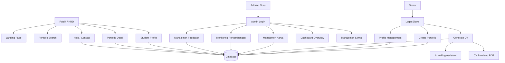
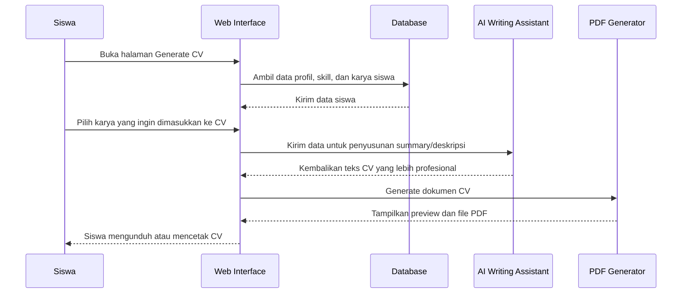
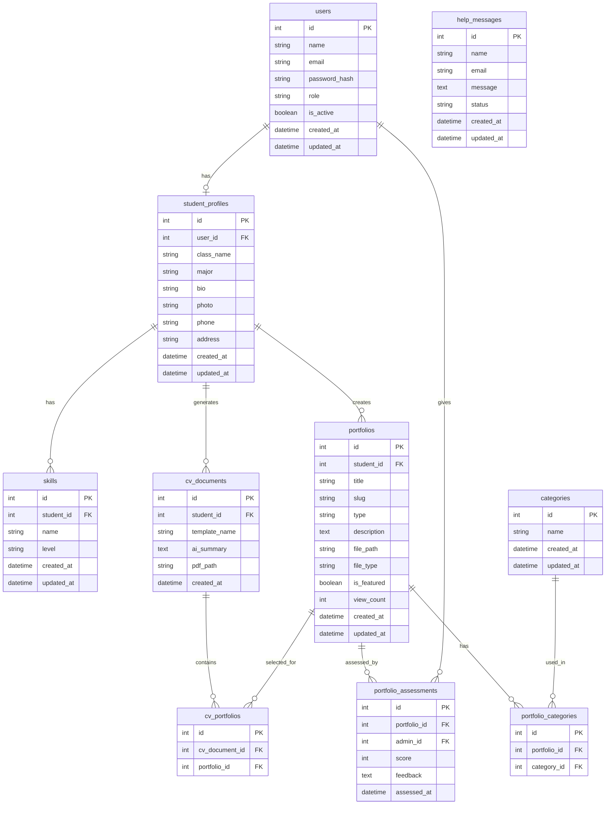

# PRD — Project Requirements Document
# Scholarchive: Student Digital Portfolio & AI CV Generator

## 1. Overview

Scholarchive adalah platform web portofolio digital siswa yang dirancang untuk menyimpan, mengelola, menampilkan, dan memantau perkembangan karya siswa secara terstruktur. Karya yang dimaksud tidak terbatas pada proyek besar atau hasil lomba, tetapi juga mencakup tugas pembelajaran yang menghasilkan produk digital, seperti poster, desain, fotografi, video podcast sederhana, presentasi, dokumen, atau tugas praktik lainnya.

Tujuan utama Scholarchive adalah menyediakan media digital yang dapat digunakan siswa untuk mendokumentasikan kompetensi, guru/admin untuk memantau perkembangan karya siswa, serta publik seperti HRD atau pihak industri untuk melihat portofolio siswa tanpa perlu login. Sistem ini bukan LMS penuh, karena tidak berfokus pada materi, absensi, kuis, atau manajemen kelas, melainkan pada dokumentasi karya, monitoring perkembangan berbasis portofolio, dan kesiapan karier siswa.

Fitur unggulan Scholarchive adalah Generate CV berbasis AI. Fitur ini membantu siswa membuat CV profesional secara otomatis berdasarkan data profil, skill, dan karya yang sudah tersimpan dalam sistem. AI digunakan sebagai asisten penulisan untuk membantu menyusun ringkasan profil, deskripsi pengalaman, dan deskripsi keterampilan agar lebih rapi dan sesuai standar CV profesional.

Pengembangan ulang website ini bertujuan untuk memperbaiki workflow, meningkatkan kualitas UI/UX, membuat alur penggunaan lebih jelas, serta menyusun sistem yang lebih modern, responsif, dan mudah dikembangkan. Desain antarmuka dapat dibuat melalui Google Stitch, sedangkan implementasi kode dapat dibantu menggunakan Antigravity atau AI coding assistant lainnya.

---

## 2. Requirements

Berikut adalah persyaratan utama sistem:

- Sistem berbasis website dan dapat diakses melalui browser desktop maupun mobile.
- Sistem memiliki tiga jenis pengguna utama: Admin/Guru, Siswa, dan Publik.
- Publik dapat mengakses landing page, mencari siswa/karya, melihat profil siswa, melihat daftar karya, membuka detail karya, dan mengirim pesan bantuan tanpa login.
- Siswa harus login menggunakan email sekolah yang terdaftar untuk menambahkan karya, mengelola profil, mengelola skill, dan menggunakan Generate CV.
- Admin/Guru harus login untuk mengakses dashboard pengelolaan, monitoring, penilaian karya, manajemen siswa, dan pesan bantuan.
- Semua karya yang diunggah siswa dapat tampil secara publik. Sistem tidak perlu menyediakan fitur public/private per karya pada MVP.
- Karya ditampilkan per item. Setiap karya memiliki halaman detail tersendiri.
- Satu karya dapat memiliki lebih dari satu kategori untuk memudahkan pengelompokan kompetensi.
- Penilaian karya bersifat opsional. Karya tugas sekolah atau praktik dapat diberi nilai oleh admin/guru, sedangkan karya lomba atau proyek pribadi dapat didokumentasikan tanpa nilai.
- Skill siswa diinput secara manual oleh siswa melalui halaman profil.
- Sistem menyediakan fitur Generate CV dengan template profesional dan output berupa PDF atau dokumen siap cetak.
- AI digunakan sebagai asisten penulisan CV, bukan sebagai satu-satunya sumber data.
- Sistem menyediakan halaman Help/Contact untuk menampung saran, pertanyaan, atau laporan kendala dari siswa maupun publik.

---

## 3. Core Features

### 3.1 Public Website

#### 1. Home / Landing Page
Halaman utama berfungsi sebagai pengenalan awal terhadap Scholarchive. Struktur halaman terdiri dari:

- Hero Section: menampilkan nama website, tagline, deskripsi singkat, dan tombol aksi utama.
- Featured Gallery: menampilkan 5 karya terbaik berdasarkan penilaian admin/guru atau jumlah kunjungan pengguna.
- About Section: menampilkan logo, deskripsi singkat website, tujuan platform, dan manfaat bagi siswa maupun pihak eksternal.
- CTA Generate CV: section ajakan untuk membuat CV profesional otomatis dari data portofolio siswa. Jika pengguna belum login, tombol diarahkan ke halaman login siswa.
- Footer: berisi navigasi ringkas dan informasi dasar website.

#### 2. Portfolio / Search Page
Halaman ini menjadi pusat pencarian dan eksplorasi portofolio siswa. Fitur utama:

- Search berdasarkan nama siswa, judul karya, kategori, atau jenis karya.
- Filter berdasarkan kategori karya atau jenis karya.
- Menampilkan card karya atau profil siswa.
- Card karya menampilkan judul, thumbnail/media, nama siswa, jenis karya, kategori, dan ringkasan singkat.
- Dapat diakses oleh publik tanpa login.

#### 3. Student Profile Page
Halaman profil siswa berfungsi sebagai halaman portofolio utama siswa. Fitur utama:

- Menampilkan data dasar siswa.
- Menampilkan foto profil atau avatar.
- Menampilkan bio singkat.
- Menampilkan daftar skill yang diinput manual oleh siswa.
- Menampilkan daftar karya siswa dalam bentuk card.
- Setiap card karya memiliki tombol menuju halaman detail karya.
- Untuk publik, halaman bersifat read-only.
- Untuk siswa pemilik akun, halaman dapat menampilkan tombol menuju Create Portfolio dan Generate CV.

#### 4. Portfolio Detail Page
Halaman detail karya menampilkan informasi lengkap dari satu karya. Isi halaman:

- Judul karya.
- Media karya, seperti gambar, dokumen, atau video.
- Deskripsi lengkap karya.
- Jenis karya.
- Kategori karya.
- Nama siswa pembuat karya.
- Jumlah kunjungan atau interaksi.
- Informasi penilaian atau feedback jika karya tersebut dinilai oleh admin/guru.

#### 5. Help / Contact Page
Halaman bantuan digunakan sebagai media komunikasi antara pengguna dan pengelola sistem. Fitur utama:

- Form nama.
- Form email.
- Form pesan, saran, pertanyaan, atau keluhan.
- Dapat diakses oleh siswa dan publik tanpa login.
- Pesan yang masuk akan dikelola oleh admin melalui dashboard.

---

### 3.2 Student Features

#### 1. Login Siswa
Siswa login menggunakan email sekolah yang sudah terdaftar dalam sistem. Setelah login, siswa dapat mengakses fitur internal seperti Create Portfolio, Profile Management, dan Generate CV.

#### 2. Create Portfolio Page
Halaman ini digunakan siswa untuk menambahkan karya baru. Field utama:

- Nama karya atau proyek.
- Jenis karya, misalnya poster, video, desain, dokumen, fotografi, atau tugas praktik.
- Deskripsi karya.
- Kategori karya, dapat lebih dari satu kategori.
- Upload file karya berupa gambar, dokumen, atau video.
- Tombol simpan untuk mempublikasikan karya ke halaman profil dan halaman portfolio publik.

#### 3. Profile Management
Siswa dapat mengelola data dasar profil dan daftar skill. Fitur utama:

- Edit foto profil.
- Edit bio atau deskripsi diri.
- Edit data kontak dasar.
- Tambah, edit, dan hapus skill.
- Skill diinput secara manual agar siswa bebas menampilkan kompetensi yang ingin ditonjolkan.

#### 4. Generate CV Page
Generate CV adalah fitur unggulan Scholarchive. Halaman ini hanya dapat diakses oleh siswa yang sudah login. Fitur utama:

- Mengambil data otomatis dari profil siswa.
- Mengambil daftar skill dari profil siswa.
- Mengambil karya terpilih dari portofolio siswa.
- Menyediakan minimal satu template CV profesional.
- Siswa dapat memilih karya mana yang ingin dimasukkan ke CV.
- AI membantu menyusun ringkasan profil, deskripsi pengalaman, dan deskripsi skill.
- Sistem menampilkan preview CV sebelum dicetak.
- Sistem menghasilkan output CV digital dalam format PDF atau dokumen siap cetak.
- CV dapat digunakan untuk melamar kerja, magang, atau kebutuhan karier lainnya.

---

### 3.3 Admin / Guru Dashboard

#### 1. Dashboard Overview
Halaman utama admin menampilkan ringkasan statistik sistem. Isi utama:

- Total siswa terdaftar.
- Total karya yang diunggah.
- Total karya yang sudah dinilai.
- Total pesan masuk dari halaman Help/Contact.
- Karya paling banyak dilihat.
- Aktivitas upload karya terbaru.

#### 2. Manajemen Data Siswa
Admin dapat mengelola data siswa. Fitur utama:

- Melihat daftar siswa.
- Menambahkan akun siswa baru.
- Mengedit data siswa.
- Menonaktifkan akun siswa jika diperlukan.
- Melihat jumlah karya dan aktivitas terakhir setiap siswa.

#### 3. Manajemen Karya
Admin dapat mengelola seluruh karya siswa yang masuk ke sistem. Fitur utama:

- Melihat daftar seluruh karya siswa.
- Membuka detail karya.
- Memberikan penilaian pada karya tertentu.
- Memberikan komentar atau feedback.
- Menentukan karya yang tampil pada Featured Gallery.
- Menghapus karya apabila melanggar aturan atau tidak sesuai.

#### 4. Monitoring Perkembangan Siswa
Monitoring dilakukan berdasarkan data karya yang dikumpulkan siswa dari waktu ke waktu. Indikator monitoring:

- Jumlah karya yang diunggah.
- Jenis dan kategori karya.
- Aktivitas terakhir siswa.
- Jumlah karya yang sudah dinilai.
- Rata-rata nilai karya yang dinilai.
- Riwayat atau timeline karya siswa.

Monitoring ini tidak berfokus pada absensi, materi, atau kuis seperti LMS, tetapi pada perkembangan hasil karya siswa sebagai bukti kompetensi.

#### 5. Manajemen Feedback / Help Messages
Admin dapat membaca dan mengelola pesan dari halaman Help/Contact. Fitur utama:

- Melihat daftar pesan.
- Membaca detail pesan.
- Menandai pesan sebagai sudah dibaca.
- Menandai pesan sebagai selesai ditindaklanjuti.

---

## 4. User Flow

### 4.1 Alur Publik / HRD
1. Publik membuka landing page Scholarchive.
2. Publik melihat Hero Section, Featured Gallery, About, dan CTA Generate CV.
3. Publik membuka halaman Portfolio/Search.
4. Publik mencari nama siswa atau karya tertentu.
5. Publik membuka profil siswa.
6. Publik melihat daftar karya siswa.
7. Publik membuka halaman detail karya untuk melihat informasi lengkap.

### 4.2 Alur Siswa Menambahkan Portofolio
1. Siswa membuka website Scholarchive.
2. Siswa login menggunakan email sekolah.
3. Siswa membuka halaman Create Portfolio.
4. Siswa mengisi nama karya, jenis karya, kategori, deskripsi, dan mengunggah file.
5. Sistem menyimpan karya.
6. Karya tampil di halaman profil siswa dan halaman portfolio publik.

### 4.3 Alur Siswa Membuat CV
1. Siswa login ke sistem.
2. Siswa membuka halaman Generate CV.
3. Sistem mengambil data profil, skill, dan karya siswa.
4. Siswa memilih karya yang ingin dimasukkan ke CV.
5. AI membantu menyusun ringkasan profil dan deskripsi pengalaman.
6. Sistem menampilkan preview CV.
7. Siswa mengunduh atau mencetak CV dalam format PDF.

### 4.4 Alur Admin Melakukan Monitoring
1. Admin login ke dashboard.
2. Admin melihat ringkasan statistik pada Dashboard Overview.
3. Admin membuka daftar siswa.
4. Admin memilih salah satu siswa untuk melihat perkembangan karya.
5. Admin melihat jumlah karya, kategori karya, timeline upload, dan rata-rata nilai.
6. Admin membuka detail karya untuk memberikan nilai atau feedback jika diperlukan.

---

## 5. Architecture

Berikut gambaran arsitektur sistem secara sederhana:

### Sequence Diagram: Generate CV

---

## 6. Database Schema

Berikut rancangan struktur database utama untuk MVP:

| Tabel | Deskripsi |
|------|-----------|
| users | Menyimpan akun admin/guru dan siswa, termasuk role dan status akun |
| student_profiles | Menyimpan data profil siswa seperti kelas, jurusan, bio, foto, dan kontak |
| skills | Menyimpan skill yang diinput manual oleh siswa |
| portfolios | Menyimpan data karya siswa, file, deskripsi, jenis karya, status featured, dan jumlah kunjungan |
| categories | Master data kategori karya |
| portfolio_categories | Relasi many-to-many antara karya dan kategori |
| portfolio_assessments | Menyimpan nilai dan feedback dari admin/guru terhadap karya siswa |
| cv_documents | Menyimpan riwayat dokumen CV yang dibuat siswa |
| cv_portfolios | Menyimpan daftar karya yang dipilih untuk masuk ke CV |
| help_messages | Menyimpan pesan, saran, atau keluhan dari siswa maupun publik |

---

## 7. Design & Technical Constraints

### 7.1 UI/UX Direction
- Desain harus modern, bersih, responsif, dan tidak terlalu kaku.
- Landing page menggunakan alur: Hero → Featured Gallery → About → CTA Generate CV → Footer.
- Halaman publik harus terasa seperti website showcase portofolio profesional.
- Halaman siswa harus fokus pada kemudahan input karya dan pembuatan CV.
- Dashboard admin harus fokus pada ringkasan data, monitoring, dan pengelolaan.
- Gunakan card, grid layout, whitespace, shadow lembut, dan tombol CTA yang jelas.

### 7.2 Role-Based Access
- Publik dapat melihat website tanpa login.
- Siswa wajib login untuk menambahkan karya, mengelola profil, dan membuat CV.
- Admin wajib login untuk mengakses dashboard pengelolaan.
- Fitur Generate CV dan Create Portfolio tidak boleh diakses oleh publik.
- Halaman portfolio publik bersifat read-only.

### 7.3 Authentication
- Login siswa menggunakan email sekolah yang sudah terdaftar.
- Admin dapat membuat atau mengelola akun siswa.
- Sistem harus membedakan akses berdasarkan role: admin, siswa, dan publik.
- Publik tidak membutuhkan akun.

### 7.4 Portfolio Rules
- Semua karya yang diunggah siswa dapat tampil secara publik.
- Tidak perlu fitur public/private per karya untuk menjaga sistem tetap sederhana.
- Karya dapat berupa tugas sekolah, proyek pribadi, karya lomba, atau tugas praktik.
- Penilaian karya bersifat opsional.
- Karya dapat memiliki lebih dari satu kategori.

### 7.5 CV Generation Rules
- CV dibuat pada halaman terpisah dari profil.
- Data CV diambil dari profil, skill, dan karya siswa.
- Siswa dapat memilih karya yang ingin dimasukkan ke CV.
- Sistem harus menyediakan minimal satu template CV profesional.
- Output utama berupa PDF atau dokumen digital siap cetak.
- AI digunakan sebagai asisten penulisan, bukan sebagai satu-satunya sumber data.
- Halaman builder CV hanya dapat diakses oleh siswa yang login.

### 7.6 Monitoring Rules
- Monitoring perkembangan siswa tidak berbasis LMS, absensi, kuis, atau materi pembelajaran.
- Monitoring dilakukan berdasarkan riwayat karya, jumlah karya, kategori karya, aktivitas upload, nilai opsional, dan feedback guru.
- Data monitoring ditampilkan pada dashboard admin/guru.

### 7.7 High-Level Technology
- Sistem dapat dibangun menggunakan teknologi web modern yang mendukung responsive design, authentication, file upload, dashboard, PDF generation, dan integrasi AI.
- Pemilihan stack teknis dapat disesuaikan dengan kebutuhan pengembang selama mendukung maintainability dan skalabilitas untuk penggunaan sekolah skala kecil hingga menengah.
- Rekomendasi umum: frontend modern berbasis component, backend dengan autentikasi role-based, database relasional, storage file, PDF generator, dan AI API untuk fitur penulisan CV.

### 7.8 Out of Scope MVP
Fitur berikut tidak wajib dibuat pada versi awal:

- LMS lengkap seperti materi pembelajaran, kuis, absensi, forum kelas, dan jadwal pelajaran.
- Fitur public/private per karya.
- Multi-template CV dalam jumlah banyak.
- Chat realtime.
- Notifikasi email kompleks.
- Sistem pembayaran atau monetisasi.
- AI untuk menilai karya secara otomatis.

---

## 8. Acceptance Criteria

Sistem dianggap memenuhi MVP apabila:

- Publik dapat membuka landing page, mencari portofolio, melihat profil siswa, dan membuka detail karya tanpa login.
- Siswa dapat login, menambahkan karya, mengelola profil, mengelola skill, dan membuat CV otomatis.
- Admin dapat login ke dashboard, melihat statistik, mengelola siswa, mengelola karya, memberi penilaian, memilih karya featured, dan membaca pesan bantuan.
- Featured Gallery dapat menampilkan 5 karya terbaik berdasarkan status featured, nilai, atau jumlah kunjungan.
- Generate CV dapat mengambil data profil, skill, dan karya siswa, lalu menghasilkan preview dan file PDF.
- Monitoring admin dapat menampilkan jumlah karya, kategori karya, aktivitas terbaru, dan nilai rata-rata siswa.
- Halaman Help/Contact dapat menerima pesan dari siswa maupun publik.

